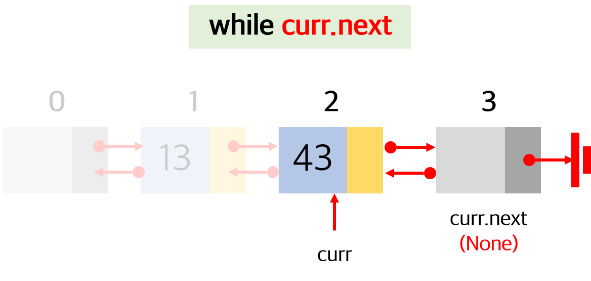
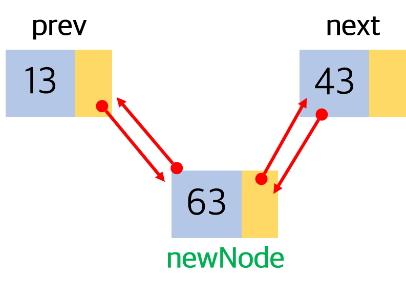
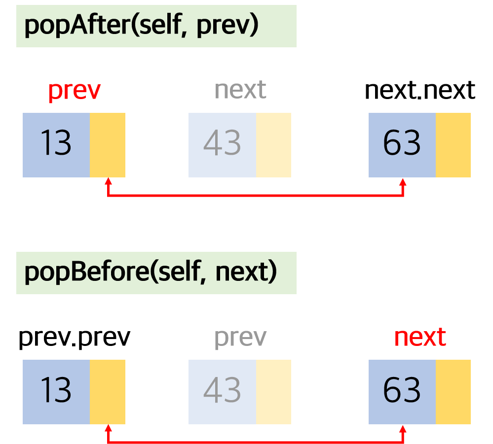

> [프로그래머스 - 어서와! 자료구조와 알고리즘은 처음이지?](https://programmers.co.kr/learn/courses/57)를 공부하며 정리한 내용입니다.

# 10강. 양방향(이중) 연결 리스트

양방향(이중) 연결 리스트는 노드끼리 서로 연결되어 있는 리스트를 의미한다. 

.jpg)

일반적인 연결 리스트는 한 방향으로(head에서 tail로)만 진행된다면, 양방향 연결 리스트는 앞, 뒤로도 진행이 가능하다.

그래서 노드를 생성할 때, `prev`에 대한 정보를 함께 포함하게 된다.

.jpg)

그리고 dummy 노드를 리스트 처음과 끝에 모두 두어야 데이터를 담고 있는 노드들은 모두 같은 형태를 띄고, 다양한 기능을 구현하는데 있어 편리해진다는 장점이 생긴다.

.jpg)

.jpg)

빨간색 글자로 표시된 부분이 기존 연결 리스트의 생성자에서 추가된 부분이다.

## 연결 리스트 순회

``` python
def traverse(self):
    result = []
    curr = self.head
    while curr.next.next:
        curr = curr.next
        result.append(curr.data)
    return result
```

기존 연결 리스트 순회와 달라진 점은 `while`문의 반복 조건이다. 기존에는 `curr.next`, 즉 다음 노드가 존재하는 경우에 순회를 진행했지만, 양방향 연결 리스트는 현재 노드보다 2번째 앞에 있는 노드의 존재가 있을 경우에만 진행한다.

이처럼 조건이 바뀐 이유는 dummy 노드가 tail에도 추가되었기 때문이다. 만약 `curr.next` 조건을 그대로 사용한다면, 아무 값도 들어있지 않은 tail 노드가 불필요한 순회 대상이 되기 때문이다. 그림으로 표현하면 다음과 같다.



## 연습문제 1. 양방향 연결 리스트 역방향 순회

### 나의 코드

> 제 10 강에서 소개된 추상적 자료구조 DoublyLinkedList 에 대하여, 또한 강의 내용에서 언급한 reverse() 메서드를 구현하세요.
> 
> 이 reverse() 메서드는 양방향 연결 리스트를 끝에서부터 시작해서 맨 앞에 도달할 때까지 (tail 방향에서 head 방향으로) 순회하면서, 방문하게 되는 node 에 들어 있는 data item 을 순회 순서에 따라 리스트에 담아 리턴합니다.
> 
> 예를 들어, DoublyLinkedList L 에 들어 있는 노드들이 43 -> 85 -> 62 라면, 올바른 리턴 값은 [62, 85, 43] 입니다.
> 
> 이 규칙을 적용하면, 빈 연결 리스트에 대한 역방향 순회 결과로 reverse() 메서드라 리턴해야 할 올바른 결과는 [] 입니다.


``` python
def reverse(self):
    answer = []
    curr = self.tail
    while curr.prev.prev:
        curr = curr.prev
        answer.append(curr.data)
    return answer
```

시작을 리스트의 맨 마지막 tail에서부터 시작해서 이전 노드를 계속 반복해서 넘어가면 된다.

## 연습문제 2. 양방향 연결 리스트 노드 삽입

> 제 10 강에서 소개된 추상적 자료구조 DoublyLinkedList 의 메서드로 insertBefore() 를 구현하세요.
> 
> 이 insertBefore() 메서드에는 두 개의 인자가 주어지는데, next 는 어느 node 의 앞에 새로운 node 를 삽입할지를 지정하고, newNode 는 삽입할 새로운 node 입니다.
> 
> 강의 내용에서 소개된 insertAfter() 메서드의 구현과 매우 유사하게 할 수 있습니다.

``` python
    def insertBefore(self, next, newNode):
        prev = next.prev
        newNode.prev = prev
        newNode.next = next
        prev.next = newNode
        next.prev = newNode
        self.nodeCount += 1
        return True
```



위의 그림처럼 next와 prev가 무엇인지 파악하고, 노드를 서로 이어주면 간단하게 해결할 수 있다.

## 연습문제 3. 양방향 연결 리스트 노드 삭제

> 제 10 강에서 소개된 추상적 자료구조 DoublyLinkedList 에 대하여 node 의 삭제 연산에 관련한 아래와 같은 메서드들을 구현하세요.
>
> ``` python
> popAfter()
> popBefore()
> popAt()
> ```
> popAfter(prev) 는 인자 prev 에 의하여 주어진 node 의 다음에 있던 node 를 삭제하고, popBefore(next) 는 인자 next 에 의하여 주어진 node 의 이전에 있던 node 를 삭제합니다. 그리고 삭제되는 node 에 담겨 있던 data item 을 리턴합니다.
>
> popAt(pos) 는 인자 pos 에 의하여 지정되는 node 를 삭제하고 그 node 에 담겨 있던 data item 을 리턴하는데, 위 popAfter() 또는 popBefore() 를 호출하여 이용하는 방식으로 구현하세요. 또한, 만약 인자 pos 가 올바른 범위 내에 있지 않은 경우에는 raise IndexError 를 이용하여 IndexError exception 을 일으키도록 구현하세요.
>
> 테스트 케이스 1-3 은 각각 (1) popAfter(), (2) popBefore(), (3) popAt() 메서드의 올바른 동작을 검증하는 케이스입니다.

``` python
def popAfter(self, prev):
        next = prev.next
        prev.next = next.next
        next.next.prev = prev
        self.nodeCount -= 1
        return next.data


    def popBefore(self, next):
        prev = next.prev
        next.prev = prev.prev
        prev.prev.next = next
        self.nodeCount -= 1
        return prev.data


    def popAt(self, pos):
        if pos < 0 or pos > self.nodeCount:
            raise IndexError
        return self.popAfter(self.getAt(pos-1))
```



간단하게 그림으로 나타내면 위의 그림과 같다.

`popAt` 메소드에서는 `popAfter`, `popBefore` 둘 중에 어떤 것을 써도 구현이 가능하다. 
만약 `popBefore`로 구현한다면 다음과 같이 구현할 수 있을 것이다.

``` python
def popAt(self, pos):
    if pos <0 or pos > self.nodeCount:
        raise IndexError
    return self.popBefore(self.getAt(pos+1))
```

즉, `getAt` 함수로 넘기는 인자값을 조정하기만 하면 간단하게 해결할 수 있다.

## 연습문제 4. 양방향 연결 리스트의 병합

> 제 10 강에서 소개된 추상적 자료구조 DoublyLinkedList 에 대하여 두 개의 양방향 연결 리스트를 앞뒤로 이어 붙이는 메서드 concat() 을 구현하세요.
>
> 예를 들어, 양방향 연결 리스트 L1 에는 1 -> 2 -> 3 의 원소가 순서대로 들어 있고, 또다른 양방향 연결 리스트 L2 에는 4 -> 5 의 순서로 원소가 들어 있을 때, 메서드 호출 L1.concat(L2) 의 결과로 L1 은 1 -> 2 -> 3 -> 4 -> 5 의 양방향 연결 리스트가 됩니다. 물론, L1 또는 L2 또는 둘 다가 비어 있는 양방향 연결 리스트인 경우도 고려되도록 코드를 작성해야 합니다.

``` python
def concat(self, L):
        if self.nodeCount + L.nodeCount == 0:
            self.head.next = L.tail
            L.tail.prev = self.head
        else:
            lastNode = self.tail.prev
            firstNode = L.head.next
            lastNode.next = firstNode
            firstNode.prev = lastNode
            self.tail = L.tail
            self.nodeCount += L.nodeCount
        return True
```

2가지 경우로 나누어서 생각하면 된다.
첫째는 빈 연결 리스트가 아닌 경우, 둘째는 빈 연결 리스트인 경우이다.
다음의 그림을 이해한다면 어렵지 않게 해결할 수 있다.

.png)

.png)

